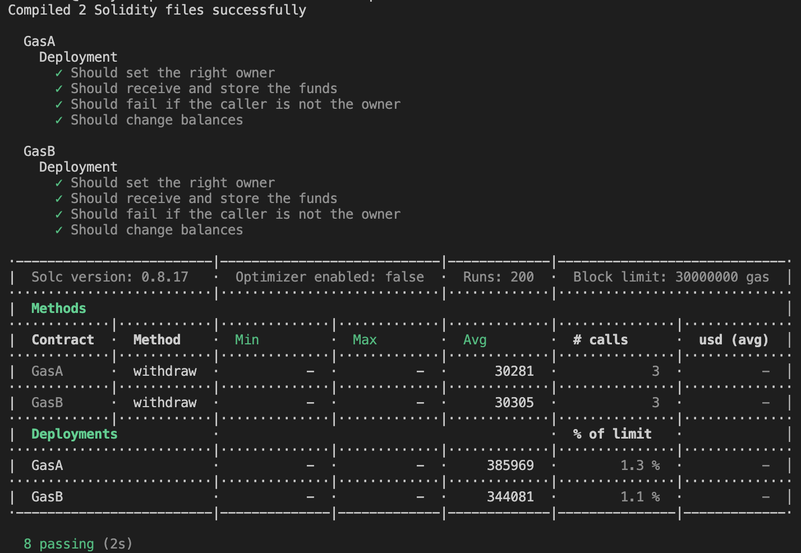

# Rare-Skill-Gas-Puzzle

This project demonstrates a basic Hardhat use case. It comes with a sample contract, a test for that contract, and a script that deploys that contract.

Try running some of the following tasks:

```shell
npx hardhat help
npx hardhat test
REPORT_GAS=true npx hardhat test
npx hardhat node
```

As you can see from the gas report, it is more costly when you deploy GasA.sol because the modifier duplicated the function code where it is used. It is however cheaper when you execute functions that have modifiers

On the other hand, it is cheaper when you deploy GasB.sol because internal functions are used to manage the checks. Hence, the function code isn't being duplicated. It is however more exppensive when you execute functions that have checks without modifiers.

Based on what is important to the developer, you might want to choose which approach works best for your project. Save gas on deployemnt, or save gas on execution.


